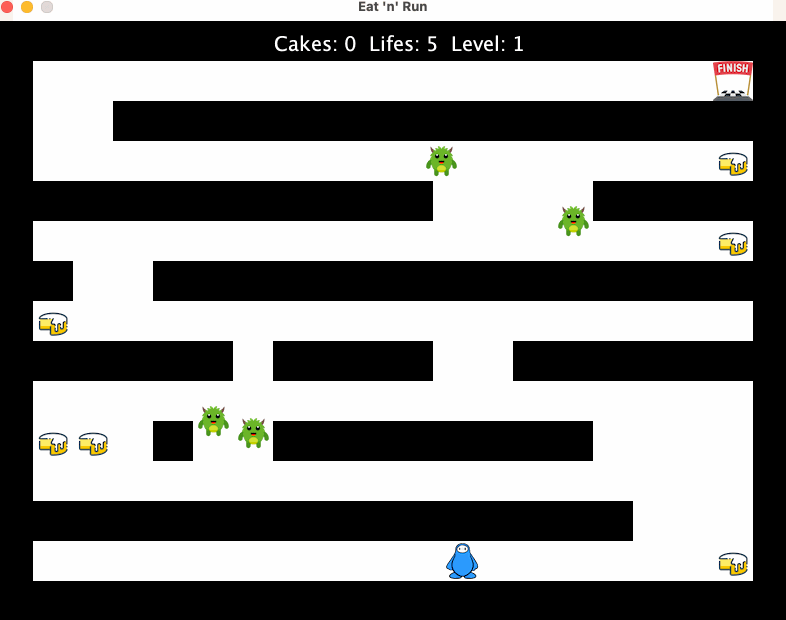
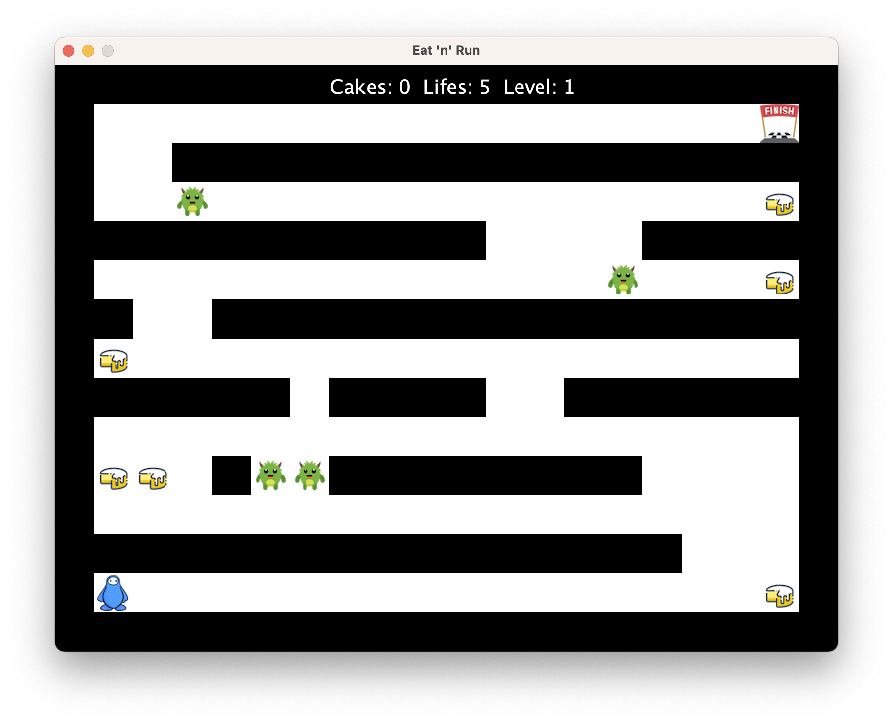

# OOP1 EN2 HS22

## Thema
In diesem Programmierprojekt geht es darum, das folgende Spiel zu programmieren:


<p>Abbildung 1: EatNRun Gameplay im Level 1 ...</p>

Das Spiel wird durch mehrere Vorgaben definiert:
- Funktionale Anforderungen
- Rahmenbedingungen
- Spezifikation der Level-Textdateien
- Nicht Funktionale Anforderungen

Bevor Sie beginnen, lesen Sie bitte alle Vorgaben sorgfältig durch.

## Funktionale Anforderungen
Dieses [Video](https://tube.switch.ch/videos/aJS1Ouz8eQ) spezifiziert die Funktionalität des Spiels.

## Rahmenbedingungen
Folgende Rahmenbedingungen müssen eingehalten werden:
- (R1) Für die Implementierung des Spiels können Arrays oder Listen verwendet. Eine kurze Einführung zu Listen finden Sie [hier](https://tube.switch.ch/videos/4bce96c3).
- (R2) Diese Prüfung ist eine **Einzelarbeit**. Gemäss Prüfungsordnung resultiert ein Verstoss gegen diese Bedingung mit der **Note 1**.
- (R3) Der/die AutorIn bleibt anonym. Es stehen also keine Namen, Email-Adressen etc. in den abgegebenen Artefakten.
- (R4) Es muss die GUI-Library verwendet werden, welche wir für das Pong-Spiel verwendet haben. Sonst dürfen, neben den Java Standard Libraries, keine zusätzlichen Abhängigkeiten verwendet werden.

Es ist wichtig, dass Ihre Lösung von den anderen Studierenden kompiliert und gestartet werden kann. Verwenden Sie nur Sprachkonstrukte, die wir auch im Unterricht (Slides, Arbeitsblätter, Übungen) verwendet haben.

## Spezifikation der Level-Textdateien
Levels sind Anordnungen von Spielelementen. Die Levels in diesem Spiel sind nicht hart codiert, sondern in Textdateien spezifiziert. Unter [resources/maps/1.txt](./resources/maps/1.txt) ist die Datei, die das erste Level beschreibt. Im Spiel schaut es so aus:


<p>Abbildung 2: 1. Level Grafik</p>
Das Window hat eine Grösse von 800 x 600 Pixel.

Die obige User Interface (UI) des Spiels wird aus folgender Beschreibung erzeugt:
```
####################
#                 F#
#  #################
#  E              C#
###########    #####
#             N   C#
##  ################
#C                 #
###### ####  #######
#                  #
#CC #NS########    #
#                  #
################   #
#P                C#
####################
```
Legende:
- `#`: Hindernis
- `P`: Player (der blaue Spieler unten links)
- `F`: Finish (das Ziel oben rechts)
- `C`: Cake (die Kuchen)
- `N` `E` `S` `W`: Die grünen Monster. Die Kürzel stehen für die Himmelsrichtung (Norden/Oben, Osten/Rechts, Süden/Unten, Westen/Links), in der sie initial loslaufen.

Jedes Zeichen steht für ein Spielelement mit der Grösse von 40 x 40 Pixel. Ausgehend von der Bildschirmgrüsse von 800 x 600 Pixel, ergibt das gerade 15 Zeilen mit jeweils 20 Zeichen. 
Modellieren Sie die Boundingbox (Breite und Höhe) für die Kollisionsdetektion des Spielers 20 x 30 Pixel, damit er besser durch kleine Lücken passt.

Für das 2. Level, spezifiziert in [resources/maps/2.txt](./resources/maps/2.txt), ist vollständigkeitshalber auch ein [Screenshot](./images/level2.png) dazu abgelegt.

## Nicht Funktionale Anforderungen (NFA)
Die NFA sind werden durch die Kriterien **NF1** (Code Organisation), **NF2** (UML Klassendiagramm) und **NF3** (Level aus Textdatei) festgelegt und sind weiter unten in den Kriterien beschrieben.


## Aufgaben

### 1. Game implementieren
Das Spiel soll sich so verhalten, wie im Video gezeigt.

Am besten gehen Sie diese Aufgabe in der folgenden Reihenfolge an:
1. Beginnen Sie mit der Figur Spieler: Die Figur soll erscheinen und bewegbar sein.
2. Fügen Sie das Ziel hinzu: Bei Kollision mit dem Spieler soll das nächste Level geladen und dargestellt werden.
3. Fügen Sie die Hindernisse hinzu: Der Spieler soll nicht durch die Hindernisse hindurchgehen können.
4. Fügen Sie dann die Cakes hinzu: Bei Kollision mit einem Spieler soll der Kuchen verschwinden.
5. Fügen Sie dann die Monster hinzu: Bei Kollision mit einem Spieler soll der Spieler ein Leben verlieren.
6. Bewegen Sie die Monster: Bei Kollision mit einer Wand soll sich die Bewegungsrichtung des Monsters um 180 Grad drehen.

Parallel dazu implementieren Sie das Auslesen der Positionen der Spielelemente aus den Level-Textdateien.


### 2. Struktur analysieren und UML Klassendiagramm zeichnen
1. Zeichnen Sie für Ihre Lösung ein UML Klassendiagramm. Dieses Diagramm soll folgende Eigenschaften haben:
   - Alle selbst geschriebenen Klassen, Enums und Interfaces und deren Vererbungsbeziehungen müssen ersichtlich sein.
   - Attribute, Operationen, Referenzen etc. müssen nicht abgebildet werden
2. Geben Sie das Klassendiagramm als Bilddatei mit dem Namen `uml-klassendiagramm.png` oder `uml-klassendiagramm.jpg` ab. Legen Sie das Bild im Wurzelverzeichnis des Projektes ab (analog README.md).

## Hinweis zum Arbeitsaufwand
Das Lösen dieser Aufgaben entspricht dem Arbeitsaufwand für zwei Wochen im Modul OOP1, also in etwa einer Arbeitszeit von **12 Stunden** (siehe auch OOP1 Drehbuch). Das ist eine Schätzung und auch eine Empfehlung. Beginnen Sie frühzeitig mit der Arbeit.

## Bewertungskriterien
In diesem Projekt gibt es 12 Kriterien und jedes Kriterium gibt 1 Punkt.
- 10 Punkte werden für funktionale Kriterien vergeben
- 2 Punkte werden für nicht funktionale Kriterien vergeben

Das Abspielen von Sounds ist optional.

> ⚠️ Die Kriterien folgen dem **Alles oder Nichts** Prinzip - für halb erfüllte Kriterien gibt es **0 Punkte**.

### Bewertung Nicht Funktionale Kriterien

#### **(NF1) Code Organisation**
Der Code ist auf mindestens zwei Packages aufgeteilt. Keine Klasse ist länger als 300 Zeilen und keine Methode ist länger als 50 Zeilen.
- (a) Nein
- (b) Ja

#### **(NF2) UML Klassendiagramm**
Das Klassendiagramm zeigt alle selbst definierten Klassen, Interfaces und Enums sowie deren Vererbungshierarchie (extends und implements).
- (a) Nein
- (b) Ja


### Bewertung Funktionale Kriterien
> Generell gilt: Das Verhalten ist so zu implementieren, wie im Video gezeigt. Das Video ist die Spezifikation.

#### **(F1) Spieler**
Der Spieler wird dargestellt und lässt sich mit den vier Pfeiltasten korrekt in die jeweiligen Richtungen bewegen.
- (a) Nein
- (b) Ja

#### **(F2) Hindernisse**
Die Hindernisse werden dargestellt. Der Spieler kann sich nicht durch diese hindurchbewegen.
- (a) Nein
- (b) Ja

#### **(F3) Monster**
Die Monster werden dargestellt. Alle Monster bewegen sich. Bei einer Kollision mit einem Hindernis, ändert das Monster seine Richtung um 180 Grad.
- (a) Nein
- (b) Ja

#### **(F4) Monster <> Spieler**
Wenn ein Monster mit dem Spieler kollidiert, wird dem Spieler ein Leben abgezogen. Die Leben werden aktualisiert dargestellt. Der Spieler wird zurück auf die Startposition gesetzt.

Ausnahme: Spielende, wird hier nicht bewertet (siehe dazu F8).
- (a) Nein
- (b) Ja

#### **(F5) Kuchen**
Die Kuchen werden dargestellt und bei Kollision mit dem Spieler, verschwindet der Kuchen und der Spieler erhält einen zusätzlichen Punkt. Die Punkte werden aktualisiert dargestellt.
Bei einer Kollision mit einem Monster werden die bereits konsumierten Kuchen nicht neu aufgetischt.
- (a) Nein
- (b) Ja

#### **(F6) Levels**
Es müssen mindestens die zwei spezifizierten Levels spielbar sein. Die Levels sind in den beiden Textdateien `1.txt` und `2.txt` im [`resources/maps`](./resources/maps/) Verzeichnis spezifiziert und müssen so aussehen, wie in den Screenshots dargestellt: [level1.png](./images/level1.png), [level2.png](./images/level2.png). 

Die Nummer des aktuellen Levels wird angezeigt. Für diese Punkte müssen die Levels nicht aus den Dateien gelesen werden, sondern sie können explizit programmiert sein.
- (a) Nein
- (b) Ja

#### **(F7) Ziel**
Das Ziel wird dargestellt. Wenn das Ziel in einem Level erreicht wird, startet das nächste Level.

Ausnahme: Spielende, wird hier nicht bewertet (siehe dazu F8).
- (a) Nein 
- (b) Ja

#### **(F8) Spielende**
Das Spiel endet auf zwei unterschiedliche Arten. Wenn der Spieler alle 5 Leben verliert, wird ein "Game Over" Screen angezeigt. Wenn der Spieler das Ziel des letzten Levels erreicht, wird ein "You Win" Screen angezeigt.
- (a) Nein
- (b) Ja

#### **(F9) Level aus Textdatei**
Die Levels werden aus den Textdateien mit dem spezifizierten Format geladen und wie spezifiziert dargestellt. Sie können dieses Verhalten testen, indem Sie die Textdatei `1.txt` modifizieren und das Spiel neu starten. Die Änderung muss nun sichtbar sein.
- (a) Nein
- (b) Ja

#### **(F10) Levelwechsel mit Textdateien**
Die verfügbaren Levels werden aus den Textdateien, im [`resources/maps`](./resources/maps/) Verzeichnis, geladen. Z.B. sind bei drei Dateien entsprechend drei Levels spielbar. Sie können dieses Verhalten testen indem Sie eine zusätzliche Textdatei `3.txt` hinzufügen. Die Reihenfolge der Levels wird eingehalten. So folgt z.B. nach dem Level 1, spezifiziert in der Datei `1.txt`, das Level, welches in der Datei `2.txt` definiert ist.
- (a) Nein
- (b) Ja


## Abgabe der Arbeit
Abgabetermin: **Donnerstag, 15.12.2022 23.59**.

Zur Abgabe müssen Sie eine anonyme Version Ihrer Lösung in der [Peergrading Webapplikation](https://www.cs.technik.fhnw.ch/peergrading/) hochladen. 
Sie können so häufig hochladen wie Sie möchten. Die letzte Abgabe vor der Deadline wird dann bewertet.

Gehen Sie dazu wie folgt vor:
1. Erstellen Sie eine Kopie des Ordners, der Ihre Lösung enthält.
2. Nennen Sie diesen Ordner `EN2_EatNRun` 
3. Löschen Sie darin alle Dateien, die Ihre Identität preisgeben könnten. 
   Beispiele:
   - `.git` Ordner
   - IDE Metadaten wie `.project` und `*.iml`
4. Dann komprimieren Sie diesen Ordern:
   - WIN: Rechtsklick  "Send To" > compressed (zipped) folder
   - OSX: Rechtsklick "compress "EN2_EatNRun"
5. Dieses Archiv laden Sie dann hoch.

## Appendix

### Sound abspielen in Java
Unter [Sound.java](./Sound.java) finden Sie eine Klasse, die Sie verwenden können um Audio Dateien abzuspielen. Konsultieren Sie die enthaltene JavaDoc um zu erfahren, wie die Klasse zu verwenden ist.

Unter [`resources/sounds`](./resources/sounds/) finden Sie passende old school Audio Dateien.


### Bilder darstellen mit der GUI Library
Benutzen Sie die folgende Methode der GUI Library:    
```java
    /**
     * Draws the image found at the given path with the center at position
     * (<code>x</code>, <code>y</code>).
     * <p>
     * Also, see {@link #drawImage(String, double, double)}.
     */
    public void drawImageCentered(String path, double x, double y) {
       ...
    }
```
Der Parameter `path` zeigt auf eine Datei im Filesystem z.B. `"resources/images/cake.png"`.

Unter [`resources/images`](./resources/images/) finden Sie passende Bilddateien.


### Textdatei auslesen
Mit folgender Methode kann eine Textdatei unter `./resources/maps/<level>.txt` zeilenweise in einen `String[]` eingelesen werden:
```java
    private static String[] loadTextFile(int level) {
        try {
            return Files.readAllLines(Paths.get("resources", "maps", level + ".txt")).toArray(new String[]{});
        } catch(IOException iox) {
            throw new RuntimeException(iox);
        }
    }
```

Mit der Methode `toCharArray()` der Klasse `java.lang.String` bekommen Sie einen Array der einzelnen Zeichen des Strings.

### Anzahl Dateien in einem Verzweichnis
Folgende Methode liefert die Anzahl `.txt` Dateien im [maps/](./resources/maps/) Verzeichnis:
```java
    public static int getNumberOfLevels() {
        try {
            return (int) Files.list(Paths.get("resources", "maps"))
                .filter(p -> p.toFile().getName().endsWith(".txt"))
                .count();
        } catch (IOException e) {
           throw new RuntimeException(e);
        }
    }
```

